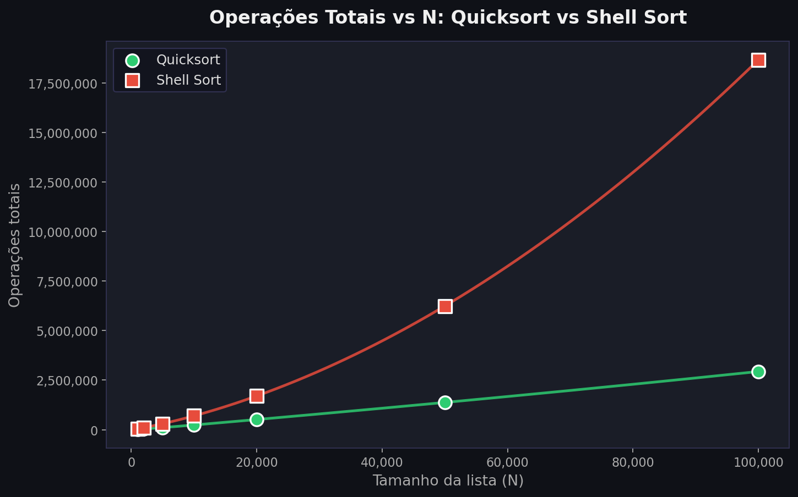
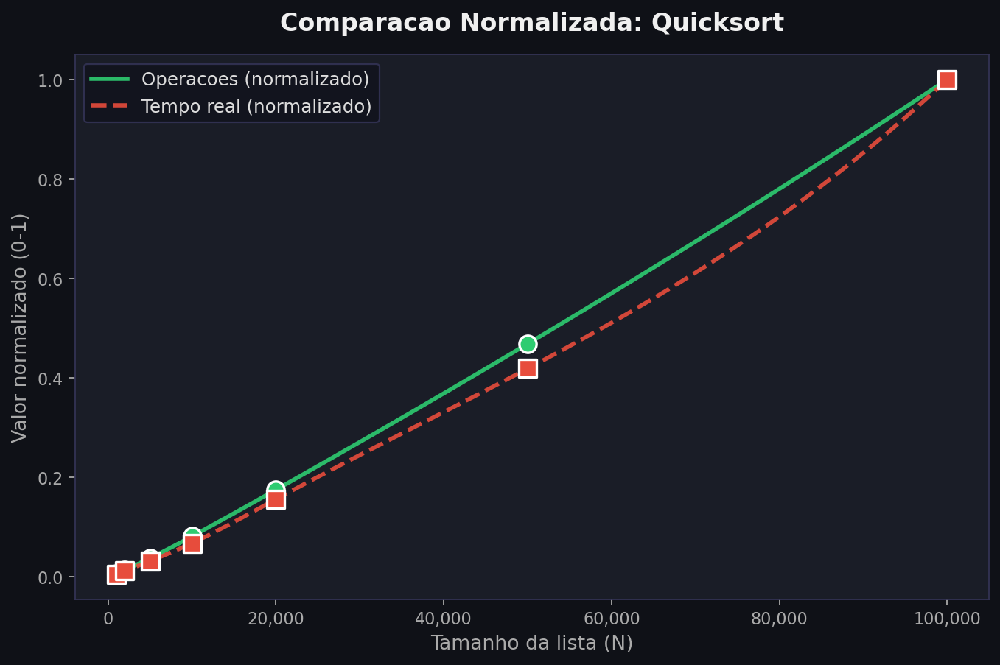
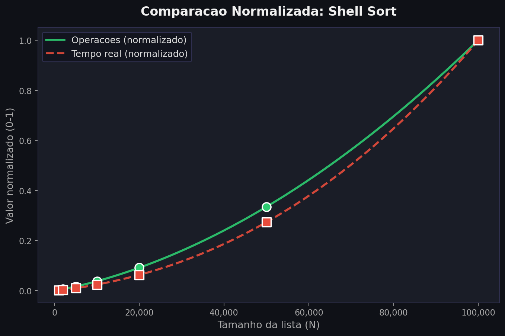

# Análise de Operações Totais vs N — Quicksort e Shell Sort

## Visão Geral

Este projeto analisa o **número total de operações** (comparações + trocas/atribuições) realizadas pelos algoritmos **Quicksort** (iterativo com pivô mediana-de-três) e **Shell Sort** (com sequência de Ciura) em função do tamanho da entrada **N**. Diferentemente da abordagem tradicional de medir tempo de execução, aqui contamos cada operação elementar, eliminando ruído do ambiente e obtendo curvas puramente algorítmicas.

Também comparamos a curva de operações com a curva de **tempo real de execução** (ambas normalizadas) para validar que a contagem de operações é um preditor fiel do comportamento observado na prática.

---

## Metodologia

```
Para cada N em [1k, 2k, 5k, 10k, 20k, 50k, 100k]:
  1. Gera 20 listas aleatórias de tamanho N
  2. Para cada lista:
       a. Ordena com o algoritmo e conta operações
       b. Ordena outra cópia e mede o tempo real
  3. Operações médias = média das 20 execuções
  4. Tempo médio = média dos 20 tempos
```

### O que conta como operação?

| Algoritmo | Operações contadas |
|:----------|:-------------------|
| Quicksort | Comparações entre elementos (`<`, `>`), trocas (`swap`) e comparações de índice |
| Shell Sort | Comparações entre elementos (`>`), atribuições (`arr[j] = ...`) e verificação de índice (`j >= gap`) |

---

## Explicação do Código

### Quicksort

O Quicksort implementado é **iterativo** (usa pilha explícita) com escolha de pivô **mediana-de-três** para evitar o pior caso O(n²):

```python
def quicksort(arr):
    stack = [(0, len(arr) - 1)]            # Pilha com intervalos [lo, hi]
    while stack:
        lo, hi = stack.pop()               # Remove um intervalo da pilha
        if lo >= hi:                       # Intervalo inválido
            continue

        # --- Mediana de três: lo, mid, hi ---
        mid = (lo + hi) // 2
        if arr[lo] > arr[mid]:             # 1ª comparação
            arr[lo], arr[mid] = arr[mid], arr[lo]   # swap
        if arr[lo] > arr[hi]:              # 2ª comparação
            arr[lo], arr[hi] = arr[hi], arr[lo]     # swap
        if arr[mid] > arr[hi]:             # 3ª comparação
            arr[mid], arr[hi] = arr[hi], arr[mid]   # swap
        pivot = arr[mid]
        arr[mid], arr[hi - 1] = arr[hi - 1], arr[mid]  # esconde pivô

        # --- Particionamento de Hoare ---
        i, j = lo, hi - 1
        while True:
            i += 1
            while arr[i] < pivot:          # busca elemento > pivô à esquerda
                i += 1
            j -= 1
            while arr[j] > pivot:          # busca elemento < pivô à direita
                j -= 1
            if i >= j:                     # ponteiros se cruzaram
                break
            arr[i], arr[j] = arr[j], arr[i]  # troca os elementos

        arr[i], arr[hi - 1] = arr[hi - 1], arr[i]  # recoloca o pivô

        # --- Empilha sub-intervalos ---
        stack.append((lo, i - 1))          # sublista esquerda
        stack.append((i + 1, hi))          # sublista direita
    return arr
```

**Partes principais:**

| Trecho | Papel |
|:-------|:------|
| `stack = [(0, len(arr)-1)]` | Pilha que substitui a recursão; cada entrada é um par `(início, fim)` |
| Mediana de três | Escolhe o pivô como a mediana entre `arr[lo]`, `arr[mid]` e `arr[hi]`, garantindo boa partição mesmo em listas ordenadas |
| `while arr[i] < pivot: i += 1` | Varre da esquerda até achar um elemento ≥ pivô |
| `while arr[j] > pivot: j -= 1` | Varre da direita até achar um elemento ≤ pivô |
| `if i >= j: break` | Se os ponteiros se cruzaram, a partição terminou |
| `stack.append(...)` | Em vez de chamar recursivamente, empilha os subintervalos para processar depois |

#### Contagem de operações no Quicksort

A função `quicksort_ops` duplica a lógica acima incrementando um contador `ops` a cada comparação ou swap:

```python
def quicksort_ops(arr):
    ops = 0
    stack = [(0, len(arr) - 1)]
    while stack:
        lo, hi = stack.pop()
        ops += 1                              # comparação lo >= hi
        if lo >= hi:
            continue
        mid = (lo + hi) // 2
        ops += 3                              # 3 comparações da mediana
        if arr[lo] > arr[mid]:
            arr[lo], arr[mid] = arr[mid], arr[lo]
            ops += 1                          # swap
        ...                                   # demais comparações e swaps
    return arr, ops
```

---

### Shell Sort

O Shell Sort generaliza o insertion sort usando **gaps** decrescentes. A sequência adotada é a de **Ciura** (1, 4, 10, 23, 57, 132, 301, 701):

```python
def shell_sort(arr):
    n = len(arr)
    gaps = [1, 4, 10, 23, 57, 132, 301, 701]
    gaps = [g for g in gaps if g < n]          # remove gaps maiores que n

    for gap in reversed(gaps):                 # do maior gap para o menor
        for i in range(gap, n):                # insertion sort com passo = gap
            temp = arr[i]
            j = i
            while j >= gap and arr[j - gap] > temp:  # desloca elementos
                arr[j] = arr[j - gap]
                j -= gap
            arr[j] = temp                      # insere no lugar correto
    return arr
```

**Partes principais:**

| Trecho | Papel |
|:-------|:------|
| `gaps = [1, 4, 10, 23, 57, 132, 301, 701]` | Sequência de Ciura — gaps com crescimento ~2.2×, empiricamente eficiente |
| `reversed(gaps)` | Itera do maior gap para o 1, refinando a ordenação a cada passo |
| `for i in range(gap, n)` | Insertion sort espacial: cada elemento `i` é comparado com o que está `gap` posições atrás |
| `while j >= gap and arr[j - gap] > temp` | Desloca para a direita enquanto o elemento anterior (no gap) for maior |
| `arr[j] = temp` | Insere o elemento na posição correta dentro da sub-sequência |

#### Contagem de operações no Shell Sort

A função `shell_sort_ops` desmembra o `while` composto em condições separadas para contar cada verificação:

```python
def shell_sort_ops(arr):
    ops = 0
    n = len(arr)
    gaps = [1, 4, 10, 23, 57, 132, 301, 701]
    gaps = [g for g in gaps if g < n]
    for gap in reversed(gaps):
        for i in range(gap, n):
            temp = arr[i]
            ops += 1                          # atribuição de temp
            j = i
            while True:
                ops += 1                      # verificação j >= gap
                if j < gap:
                    break
                ops += 1                      # arr[j - gap] > temp
                if not (arr[j - gap] > temp):
                    break
                arr[j] = arr[j - gap]
                ops += 1                      # atribuição no deslocamento
                j -= gap
            arr[j] = temp
            ops += 1                          # atribuição final
    return arr, ops
```

A separação do `while` composto (`j >= gap and arr[j - gap] > temp`) em dois `if` consecutivos permite contar individualmente a verificação de índice e a comparação entre elementos, evitando o curto-circuito do `and` que esconderia operações.

---

## Gráficos

### Operações Totais vs N



**O que mostra:** O crescimento do número total de operações em função do tamanho da lista para Quicksort e Shell Sort. A escala linear evidencia que o Shell Sort realiza muito mais operações que o Quicksort para os mesmos N, especialmente à medida que N cresce.

**Interpretação:** O Quicksort apresenta crescimento **O(n log n)** — visível na curvatura suave e amortecida. O Shell Sort exibe crescimento mais acelerado, consistente com sua complexidade teórica ~~ O(n^(1.25)) a O(n²) dependendo da sequência de gaps.

---

### Comparação Normalizada — Quicksort



**O que mostra:** As curvas de **operações** e **tempo real**, ambas normalizadas (divididas pelo valor máximo), sobrepostas no mesmo gráfico.

**Interpretação:** As curvas praticamente coincidem, comprovando que a contagem de operações é diretamente proporcional ao tempo de execução real. O Quicksort mantém proporcionalidade quase perfeita porque suas operações são predominantemente comparações e swaps de custo constante.

---

### Comparação Normalizada — Shell Sort



**O que mostra:** O mesmo tipo de comparação para o Shell Sort.

**Interpretação:** A sobreposição é boa, confirmando que mesmo para um algoritmo com padrão de acesso à memória menos regular (acessos com stride variável), a contagem de operações elementares captura corretamente o crescimento da complexidade.

---

## Resultados

| N | Quicksort (ops) | Shell Sort (ops) |
|--:|----------------:|-----------------:|
| 1.000 | 18.281 | 46.759 |
| 2.000 | 40.379 | 105.338 |
| 5.000 | 110.054 | 304.028 |
| 10.000 | 239.214 | 699.708 |
| 20.000 | 514.334 | 1.703.781 |
| 50.000 | 1.376.549 | 6.243.406 |
| 100.000 | 2.937.978 | 18.660.359 |

---

## Estrutura do Projeto

```
.
├── sorting.py          ← Algoritmos de ordenação (+ versões com contagem de operações)
├── main.py             ← Script principal (coleta dados e gera plots)
├── visualization.py    ← Funções de plotagem (3 gráficos)
├── models.py           ← Modelos de regressão (não utilizados no plot principal)
├── benchmarking.py     ← Utilitários de benchmark
├── resultados/
│   └── imagens/
│       ├── operacoes_vs_n.png
│       ├── comparacao_normalizada_quicksort.png
│       └── comparacao_normalizada_shell_sort.png
└── README.MD           ← Este arquivo
```

---

## Como Executar

### Pré-requisitos

```bash
pip install numpy matplotlib scipy
```

### Execução

```bash
python3 main.py
```

O progresso é exibido no terminal e os gráficos são salvos em `resultados/imagens/`.

---

## Configurações Ajustáveis

No topo de `main.py`:

| Parâmetro | Padrão | Descrição |
|:----------|-------:|:----------|
| `TAMANHOS` | `[1k, 2k, 5k, 10k, 20k, 50k, 100k]` | Tamanhos de N testados |
| `N_LISTAS` | `20` | Quantidade de listas por N (a média é calculada) |
| `SEED` | `42` | Semente aleatória para reproducibilidade |

---

## Referências

- Knuth, D. E. *The Art of Computer Programming*, Vol. 3: Sorting and Searching.
- Ciura, M. (2001). *Best Increments for the Average Case of Shell Sort*. PPAM.
- Sedgewick, R. & Wayne, K. *Algorithms*, 4ª ed.
